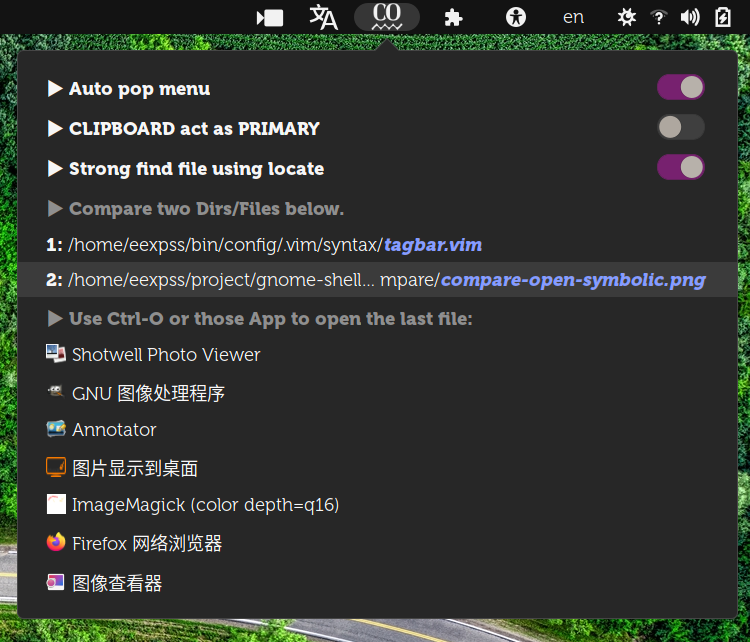

# gnome-shell-compare


Copy two file/dir names from anywhere such as `nautilus` or `gnome-terminal`, and then compare them.

从“nautilus”或“gnome terminal”等任意位置复制两个文件/目录名，然后进行比较。

It needs to be copied twice. Only one file or directory can be copied each time, otherwise the copy is invalid.

需要复制两次。每次只能复制一个文件或目录，否则复制无效。

Meld must be installed.

需要安装了 meld 软件。



```
⭕ tree ~/.local/share/gnome-shell/extensions/compare@eexpss.gmail.com
├── extension.js
└── metadata.json
```
